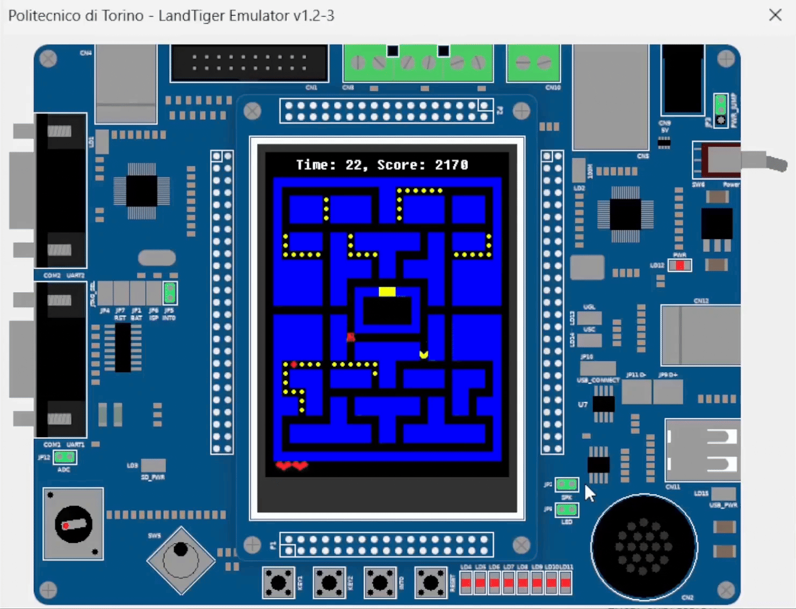

# 👾 Pac-Man on LandTiger 👾
Hi there! Welcome to **Pac-Man on LandTiger**, a playful spin on the classic arcade game but with a twist: it's running on the LandTiger development board!

Let me give you a quick tour of what I've done. 🚀

### 🎯 **Extra Point 1:** The Basics
- Designed a maze for Pac-Man filled with 240 **Standard Pills** and 6 randomly appearing **Power Pills**.
- Pac-Man chomps his way through the maze, earning:
  - **10 points** for each Standard Pill
  - **50 points** for Power Pills.
- Earn **extra lives every 1000 points** (because munching pills is hard work!).  
- Navigate Pac-Man using a joystick! He keeps moving in the chosen direction unless:
  - You change direction, or  
  - He bumps into a wall. 🚧  
- **Teleportation?** Oh, yes! Across the maze's central corridors, Pac-Man can zip between one side of the screen and the other! 🌀
- Cleared all the pills? 🎉 It’s a **Victory** screen!  
- Ran out of time? ⏱️ That’s a **Game Over** screen (but don’t worry, there’s always another round!).

### ⭐ **Extra Point 2:** The Ghostly Challenge  
Things got spooky (and a lot more fun!) when **Blinky**, the ghost, entered the game! Here’s what makes it special:
- **Blinky’s Moves:** 
  - In **Chase Mode**, he’s out to eat Pac-Man (and he gets faster as the game progresses—yikes!) 👻
  - In **Frightened Mode**, triggered when Pac-Man eats a Power Pill, Blinky turns blue, flees in terror, and... wait for it... can be EATEN for an extra **100 points!** 😱
- Did I mention the sounds? With a configured speaker, there’s **background music** and sound effects to make things more exciting! 🎶  
- Added some **CAN-bus communication magic** ✨: The game now sends its current score, remaining lives, and countdown timer as real-time messages over the CAN-bus (because.. why not?).

## My Favorite Part! 😄
The coolest moment? Watching **Blinky** come to life! Using a simple pathfinding algorithm, Blinky turned into a legitimate maze-tracker. Seeing him get "frightened" when Pac-Man gobbled a Power Pill was just... *chef’s kiss*. 👻💨

## Try It Yourself 🕹️
Want to check out the game? Here’s what you need to do:
1. Open the Keil workspace included in the project folder.  
2. Plug in a LandTiger Board or launch the PoliTO LandTiger Emulator and enjoy the fun (because playing Pac-Man is way better than reading about it).  
3. Challenge yourself to beat the timer and dodge Blinky.  

**Happy gaming!** 🎮